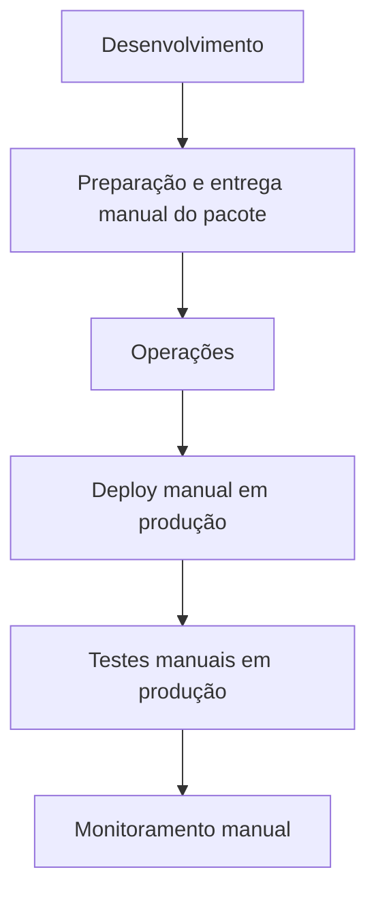
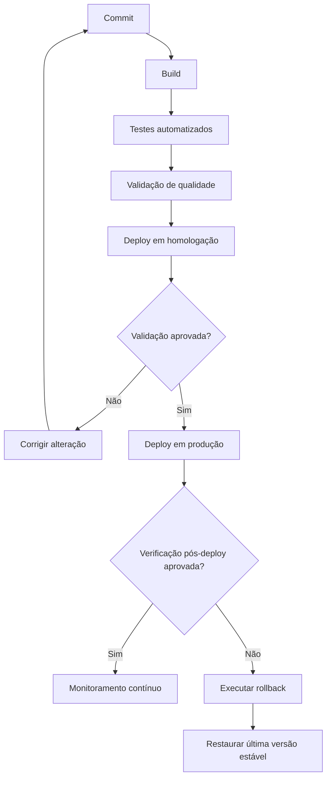

# Solução do Desafio DevOps

## Introdução

Este documento apresenta uma proposta conceitual de implementação de práticas DevOps para a empresa fictícia Tech, utilizando o modelo CALMS e as Três Maneiras do DevOps.

O objetivo é reduzir gargalos operacionais, melhorar a qualidade das entregas e aumentar a colaboração entre as equipes, sem depender da adoção de ferramentas ou tecnologias específicas.

---

# 1. Diagnóstico Cultural (Culture)

## Processo Analisado

O processo escolhido foi o fluxo de entrega de software, desde a conclusão do desenvolvimento até a disponibilização em produção.

### Fluxo Atual

## Problemas Identificados

* Desenvolvimento e Operações trabalham de forma isolada.
* A equipe de Operações concentra a responsabilidade pela implantação e validação.
* Deploys são executados manualmente e sem procedimento padronizado.
* Testes são realizados somente após a implantação em produção.
* O feedback sobre falhas chega tarde aos desenvolvedores.
* O processo é suscetível a erros humanos e retrabalho.
* A dependência de apenas um profissional com conhecimento em Delphi representa risco para o sistema legado.

## Oportunidades de Melhoria

* Estabelecer responsabilidade compartilhada pelo fluxo de entrega.
* Padronizar e automatizar atividades repetitivas.
* Antecipar testes e validações antes da produção.
* Criar mecanismos rápidos de feedback entre as equipes.
* Compartilhar o conhecimento sobre o sistema legado.

## Estratégia Cultural

A transformação deve ser conduzida de forma colaborativa. Desenvolvimento e Operações participarão do desenho do novo processo, da definição de responsabilidades e da avaliação dos resultados.

Para reduzir possíveis resistências, a mudança será implantada gradualmente, acompanhada de capacitação e comunicação clara sobre os benefícios esperados. A automação será apresentada como uma forma de reduzir tarefas repetitivas e liberar as equipes para atividades de maior valor.

---

# 2. Automação (Automation)

## Proposta

Implementar um pipeline automatizado para validar e implantar as aplicações. Cada etapa deverá possuir critérios claros de sucesso, impedindo que alterações com falhas avancem no fluxo.

### Fluxo Proposto

Em caso de falha na implantação ou na verificação pós-deploy, deverá existir um procedimento padronizado de rollback para restaurar a última versão estável.

## Benefícios Esperados

* Redução de erros manuais.
* Identificação antecipada de falhas.
* Menor tempo de entrega.
* Maior previsibilidade e segurança dos deploys.
* Recuperação mais rápida em caso de incidentes.

## Plano de Implementação Gradual

### Etapa 1 - Preparação

* Mapear detalhadamente o fluxo atual e definir responsabilidades compartilhadas.
* Padronizar o fluxo de versionamento e os critérios para aprovação de mudanças.
* Documentar os procedimentos atuais de build, testes, deploy e rollback.

### Etapa 2 - Projeto-piloto

* Iniciar pela plataforma de e-commerce, evitando que as limitações do sistema legado bloqueiem a evolução inicial.
* Automatizar primeiro o build, os testes e as validações.
* Comparar os resultados do piloto com os indicadores atuais.

### Etapa 3 - Implantação Automatizada

* Adicionar o deploy em homologação e as verificações pós-deploy.
* Automatizar o deploy em produção após a estabilização do fluxo.
* Validar e exercitar o procedimento de rollback.

### Etapa 4 - Expansão e Evolução

* Expandir o processo para o sistema legado, considerando suas limitações.
* Capacitar outros profissionais e reduzir a dependência do especialista em Delphi.
* Revisar continuamente o fluxo com base nas métricas e no feedback das equipes.

## Responsabilidades

* **Desenvolvimento:** criar e manter testes, corrigir falhas identificadas e participar do acompanhamento em produção.
* **Operações:** definir requisitos operacionais, colaborar com a automação e orientar monitoramento e recuperação.
* **Responsabilidade compartilhada:** acompanhar métricas, revisar incidentes e aprimorar continuamente o processo.

## Horizonte de Implementação

| Período | Objetivo |
| --- | --- |
| Primeiros 30 dias | Mapear e padronizar o processo, definir responsabilidades e preparar o projeto-piloto |
| De 31 a 60 dias | Executar o piloto com build, testes e validações automatizadas |
| De 61 a 90 dias | Incluir deploy, verificação pós-deploy e rollback no fluxo automatizado |
| Após 90 dias | Avaliar resultados, ajustar o processo e planejar a expansão para o sistema legado |

---

# 3. Lean ("Pensamento Enxuto")

O princípio Lean será aplicado por meio da identificação e redução de atividades que não agregam valor ao cliente.

## Desperdícios Identificados

| Desperdício | Situação Atual | Melhoria Proposta |
| --- | --- | --- |
| Espera | Código aguarda em média dois dias para ser implantado | Automatizar e simplificar o fluxo de entrega |
| Transferência manual | Desenvolvimento prepara e encaminha pacotes para Operações | Criar um fluxo padronizado e compartilhado |
| Defeitos e retrabalho | Deploys manuais apresentam taxa de sucesso de 80% | Antecipar testes e validações |
| Trabalho manual repetitivo | Deploy, testes e monitoramento dependem de execução manual | Automatizar atividades previsíveis |
| Dependência de especialista | Apenas um profissional conhece o sistema legado | Documentar e compartilhar o conhecimento |

As melhorias serão implementadas em pequenas etapas, avaliadas por métricas e ajustadas antes de sua expansão.

---

# 4. Mensuração (Measurement)

## Métricas

| Métrica | Situação Atual | Meta |
| --- | --- | --- |
| Tempo entre entrega e deploy | 2 dias | 1 hora |
| Taxa de sucesso dos deploys | 80% | 95% |
| Incidentes pós-deploy | 2 por semana | 1 por semana |
| MTTR | 4 horas | 1 hora |
| Frequência de deploy | Não informada | Estabelecer linha de base e aumentar gradualmente |

## Plano de Acompanhamento

* Registrar automaticamente os horários, resultados e falhas de cada etapa do fluxo.
* Registrar incidentes, tempo de recuperação e ações corretivas.
* Avaliar semanalmente os resultados durante o projeto-piloto.
* Após a estabilização, avaliar os indicadores mensalmente.
* Manter um painel compartilhado e acessível às duas equipes.
* Revisar as metas quando houver evolução consistente ou mudanças no contexto.

As métricas devem orientar melhorias e não ser utilizadas para responsabilizar individualmente os profissionais.

---

# 5. Compartilhamento de Conhecimento (Sharing)

## Documentação

Manter documentação atualizada sobre o fluxo de entrega, responsabilidades, critérios de aprovação, rollback e resolução de incidentes.

O conhecimento sobre o sistema legado deverá ser documentado e compartilhado para reduzir a dependência de um único profissional.

## Capacitação

Realizar sessões práticas entre Desenvolvimento e Operações durante a implantação do novo processo. A capacitação deve permitir que todos compreendam o fluxo completo, e não apenas suas etapas individuais.

## Reuniões de Compartilhamento

Realizar encontros periódicos entre as equipes para apresentar resultados, compartilhar experiências e alinhar melhorias.

## Retrospectivas e Incidentes

Analisar os resultados após cada ciclo de entrega e realizar revisões de incidentes sem culpabilização. Cada análise deverá gerar aprendizados, ações de melhoria, responsáveis e prazos de acompanhamento.

---

# 6. As Três Maneiras do DevOps

## Primeira Maneira - Acelerar o Fluxo

### Situação Atual

O fluxo de entrega depende de transferências entre equipes e de múltiplas atividades manuais.

### Proposta

* Automatizar atividades repetitivas.
* Reduzir transferências manuais e tempos de espera.
* Trabalhar com mudanças menores e mais frequentes.
* Estabelecer critérios claros para a passagem entre as etapas.

### Resultado Esperado

Redução do Lead Time, maior frequência de entrega e fluxo mais previsível.

---

## Segunda Maneira - Ampliar o Feedback

### Situação Atual

O feedback ocorre principalmente após o deploy em produção, quando a correção é mais cara e arriscada.

### Proposta

* Executar testes e validações durante todo o fluxo.
* Notificar rapidamente as equipes quando uma etapa falhar.
* Compartilhar os resultados dos deploys, métricas e incidentes.
* Incorporar o feedback de operação e dos usuários ao planejamento das próximas mudanças.

### Resultado Esperado

Identificação antecipada de problemas, redução de falhas em produção e decisões baseadas em informações compartilhadas.

---

## Terceira Maneira - Experimentar e Aprender

### Situação Atual

As falhas são tratadas principalmente como problemas operacionais, sem um processo estruturado para gerar aprendizado.

### Proposta

* Implementar mudanças pequenas, controladas e reversíveis.
* Utilizar o projeto-piloto para validar hipóteses antes da expansão.
* Realizar retrospectivas e revisões de incidentes sem culpabilização.
* Registrar e acompanhar as ações de melhoria identificadas.
* Exercitar procedimentos de recuperação para aumentar a preparação das equipes.

### Resultado Esperado

Maior colaboração, redução do risco das mudanças e evolução contínua dos processos.

---

# Conclusão

A adoção dos princípios CALMS e das Três Maneiras do DevOps permitirá que a empresa Tech reduza atividades manuais, aumente a confiabilidade das entregas e fortaleça a colaboração entre Desenvolvimento e Operações.

A transformação começará pela plataforma de e-commerce como projeto-piloto e será expandida gradualmente com base nos resultados obtidos. O sistema legado será tratado de acordo com suas limitações, acompanhado de documentação e compartilhamento de conhecimento para reduzir riscos.

Com responsabilidades compartilhadas, automação, redução de desperdícios, métricas e aprendizado contínuo, a empresa criará uma base sólida para entregar valor aos clientes com maior velocidade e segurança.
